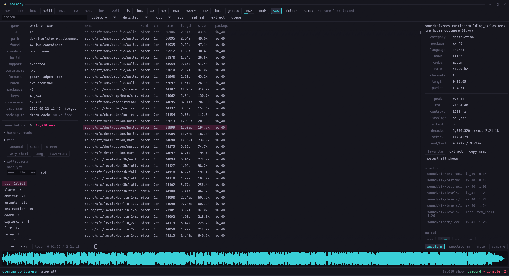

<div align="center">

# harmony

**An audio asset explorer for Call of Duty: browse it, hear it, take it out.**



[Features](#features) ·
[Supported games](#supported-games) ·
[Quick start](#quick-start) ·
[Using it](#using-it) ·
[Command line](#command-line) ·
[Privacy](#privacy)

</div>

## About

Point harmony at a Call of Duty install. It works out which game it is, finds the
containers, and lists every sound in them with what it knows about each one: name or key,
package, codec, sample rate, channels and length. It writes them out as wav, flac, ogg, or
exactly the bytes that were in the container.

Extraction is one of the things it does, not what it is. The identity is *explorer*:
waveform analysis, collections, cross-game comparison, search over a hundred thousand
names, and batch export all fit under the same roof.

> [!NOTE]
> harmony is a Windows desktop app written in Rust with `eframe`/`egui`. The Opus decoder
> is pure Rust, so building it needs no C toolchain and no cmake.

<p align="right">(<a href="#harmony">back to top</a>)</p>

## Features

- **Twenty-one titles**, from Call of Duty 4 to Modern Warfare 4, each opening straight
  into the folder it was last pointed at.
- **Fast scans.** Containers are catalogued from their tables and headers; no sound is read
  until it is played or exported. Scans are cached, so a game reopens instantly.
- **Playback and analysis.** Waveform, spectrogram, metadata, and a comparison against
  another sound.
- **Search.** Plain words or `key:value` terms such as `length:<2`, `channels:2`,
  `named:no`, `mode:zombies`.
- **Export queue.** As many runs as you give it, split into lanes that run side by side,
  paused and picked up again after a crash, dragged straight out to Explorer.
- **A console.** Tilde opens it: channels, levels, folded detail, and a dotted command for
  everything the window can do.
- **Your own names.** The modern games store hashes. Load a list and they become names;
  without one they stay as keys that still play and still extract.

<p align="right">(<a href="#harmony">back to top</a>)</p>

## Supported games

| Tab | Game | Id | Status | Where the sounds live | Container |
| --- | --- | --- | --- | --- | --- |
| mw4 | modern warfare 4 | `rex` | partial | `cod26\` | kapi `.xpak` / `.xsub` |
| mwiii | modern warfare iii | `jup` | verified | `cod23\`, `zone\` | kapi `.xpak` / `.xsub` |
| mwii | modern warfare ii | `iw9` | expected | `zone\`, `sp22\`, `mp22\` | kapi |
| cw | black ops cold war | `t9` | partial | `zone\` | kapi `.xsub`, oodle blocks, opus inside |
| mw19 | modern warfare 2019 | `iw8` | partial | `zone\` | kapi |
| bo6 | black ops 6 | `t10` | detect only | `zone\` | kapi |
| bo7 | black ops 7 | `t11` | partial | `zone\` | kapi |
| bo4 | black ops 4 | `t8` | expected | `zone\snd\<language>\` in casc | battle.net casc, sab banks, flac |
| bo3 | black ops iii | `t7` | verified | `zone\snd\<language>\` | sab banks (`.sabs`, `.sabl`), flac |
| bo2 | black ops ii | `t6` | verified | `sound\` | sab banks (`.sabs`, `.sabl`) |
| bo1 | black ops | `t5` | verified | `main\` | `.iwd` archives, ms-adpcm |
| iw | infinite warfare | `iw7` | verified | install folder, `<language>\` | sab banks, flac |
| mw3 | modern warfare 3 | `iw5` | partial | `zone\`, `zone\<language>\` | `.ff` fastfiles, pcm inside |
| ghosts | ghosts | `iw6` | partial | `zone\**\soundfile*.pak` | flac streams |
| aw | advanced warfare | `s1` | partial | `zone\**\soundfile*.pak` | flac streams |
| wwii | wwii | `s2` | partial | install folder, `<language>\` | `soundfile*.pak`, flac streams |
| mwr | modern warfare remastered | `h1` | partial | install folder, `<language>\` | `soundfile*.pak`, flac streams |
| mw2cr | mw2 campaign remastered | `h2` | partial | `Data\data\` | battle.net casc, flac streams |
| mw2 | modern warfare 2 | `iw4` | verified | `main\`, `zone\` | `.iwd` archives and `.ff` fastfiles |
| waw | world at war | `t4` | verified | `main\`, `zone\` | `.iwd` archives |
| cod4 | call of duty 4 | `iw3` | verified | `main\`, `zone\` | `.iwd` archives and `.ff` fastfiles |

**Verified** means harmony has read that install end to end. **Expected** means the
container format matches and the same reader should apply. **Detect only** means harmony
recognises the install but does not yet claim to read its audio.

**Partial** means the audio comes out but the names do not, for one of two reasons. The
older titles' sound paks have no index harmony can read yet, so their streams are found by
their own magic and carry no names at all. The newer ones do carry names, hashed, and
harmony ships no name lists to turn them back, so their sounds play and extract under their
keys until you point harmony at a list of your own.

> [!NOTE]
> The Battle.net copy of Modern Warfare 2 Campaign Remastered has no container files on
> disk at all, only CASC archives. Harmony reads the storage itself — the local indices,
> the encoding table and the TVFS root — to find the sound paks inside it, then carves the
> same flac streams out of them as it does for Ghosts and Advanced Warfare. 546 sound
> packages, 141,329 sounds. Blocks that are encrypted stay encrypted: harmony ships no keys.

Call of Duty 4 and Modern Warfare 2 keep audio in two places at once: the streamed sounds
sit in the `.iwd` archives, and the sounds a level loads with it sit inside the fastfiles
under `zone`. Neither set is a copy of the other, so harmony reads both — 21,974 sounds for
Call of Duty 4 against 17,112 from the archives alone. Modern Warfare 2 and Modern Warfare
3 were both re-released as 64-bit executables with the same containers inside; harmony
reads either and says which one is installed, taken from the game's own binary.

Codecs read: Opus, FLAC, MP3, PCM 16 and 24 bit, and Microsoft and IMA ADPCM. Sab banks
store their audio with the header stripped off; harmony rebuilds it from the bank's own
table, so what comes out is a file that plays anywhere.

<p align="right">(<a href="#harmony">back to top</a>)</p>

## Quick start

Build it:

```bash
cargo build --release
```

Needs a Rust toolchain with the 2024 edition. Run `target/release/harmony.exe`, then drop a
game folder on the window or press **folder**.

1. A new folder scans by itself. **Deep** is the depth that finds everything.
2. Click a sound to hear it. Space plays and pauses, the arrow keys walk the list.
3. Select sounds, or none for everything shown, and press **extract**.

> [!WARNING]
> The build fails with `Access is denied (os error 5)` while `harmony.exe` is running.
> Close it first, but never while an export is going.

<p align="right">(<a href="#harmony">back to top</a>)</p>

## Using it

**Scanning.** On the kapi titles nothing in a package says what it holds, so the depth
matters. **Quick** reads the localised packages only, which hold the dialogue and nothing
else. **Deep** samples every package and reads the ones with audio in them — minutes, and
this is the one that finds weapons, music and ambience. **Full** reads every entry of every
package. The older titles carry a table of their own, so the whole catalogue arrives in
seconds whatever the depth says. Results stream in while the scan runs, the scan writes its
own cache as it goes, and scans of different games run at the same time.

**Browsing.** Eight views, from a grid of tiles to a tree that stacks mode, category,
bucket and the folders in the sound's own name. Right-click a sound for play, extract, drag
out, favorite, tags and group selection; ctrl-click adds to the selection, shift-click takes
a run. Every view works the same way, including the drag out of the window.

**Exporting.** **extract** sends the selection, or everything shown, to the queue.
**extract library** takes the whole game into a folder named for the id, the game and the
build — `[t7] black ops iii - 1.0.0.2` — written by every core the machine can spare bar
two, leaving a `liblog.txt` saying what was done, what was left out and what failed. A
second export joins the line rather than replacing it, **split view** runs lines side by
side, and an export writes a note to disk as it goes, so a crash, a kill or a pulled plug
all leave a run that can be picked up where it stopped.

**Formats out.** **wav** (decoded PCM), **flac** (lossless, a copy rather than a re-encode
wherever the sound is flac already), **ogg** (the original Opus packets remuxed, no
re-encode) and **raw** (the blob as the container holds it, with the header a sab bank
leaves off put back).

**Names.** The modern games store hashes. Press **names** to load your own list, either
`hash,name` pairs or a plain wordlist, which harmony hashes every way the engines have
used: fnv-1a 64 folded as the engine folds it, the same over the name as written, the
63-bit asset hash of the newer Infinity Ward titles, the script hash of Modern Warfare II
and III, fnv-1a 32 for the older Treyarch banks, and dbj2. What matches is named; the rest
stay as keys that still play and still extract. Harmony does not invent a mapping that is
not there.

**The console.** Tilde opens it from anywhere. Channels — `app`, `game`, `scan`, `pack`,
`export`, `audio`, `names`, `disk`, `discord`, `debug` — filter with a chip each, levels
filter the same way, and a line with more to say carries it folded underneath. Commands are
dotted, so a family reads as one thing: `export.library`, `lane.split`, `resume.start`,
`crash.dump`. Tab completes, and `help` lists the lot.

**When something falls over.** A folder per fall under `%APPDATA%\harmony\crashes\`, named
for the moment it happened, holding the report, the console scrollback and the state as
json. A panic on a worker does not take the window with it. Nothing in a report leaves the
machine.

<p align="right">(<a href="#harmony">back to top</a>)</p>

## Command line

The window is the app, but every subsystem also runs without it, which is how it is tested.

```text
harmony --root "<game folder>"                 open the window on a folder
harmony --probe "<game folder>" [deep|full]    scan and report, and fill the cache
harmony --packages "<game folder>"             list packages and entry counts
harmony --hits "<game folder>" <package>       how much of one package is audio
harmony --dump "<game folder>" <package> [n]   entry layout of a package
harmony --grab "<game folder>" <package> <key> one blob to a file
harmony --stream <file>                        work out a blob's seek table
harmony --sound <file> [out.wav]               decode one file and measure what came out
harmony --room [folder]                        free space where harmony writes

harmony --zone <fastfile> [out folder]         every sound inside one fastfile, as wavs
harmony --inflate <fastfile> <out file>        the zone behind a fastfile, uncompressed
harmony --casc <game folder> [extension]       what a battle.net storage holds
harmony --opus-keys <game folder> <package>    what an encrypted package would need

harmony --hash <name> [name...]                a name under every hash harmony tries
harmony --names <game key> <depth> <list...>   match a cached scan against name lists
harmony --names-probe <game key> <depth> <csv> how much of a scan one list names
harmony --sort <game key> <depth>              how a cached scan files itself

harmony --pull <game folder> <n> <out> [split] n sounds out in all four formats, through
                                               the real queue; "split" gives each format a
                                               lane of its own instead of a place in the line
harmony --crash-report [panic]                 write a crash report; "panic" falls over on
                                               purpose to prove the hook
```

<p align="right">(<a href="#harmony">back to top</a>)</p>

## Where harmony keeps things

`%APPDATA%\harmony\` holds `settings.json`, the cached catalogue of each scan
(`scan-<game>-<depth>.json`), what each fastfile turned out to hold (`zones-<game>.json`),
a `resume` folder with one note per export that has been put down, `console.log`, and a
`crashes` folder holding the last twenty reports.

The cache, scratch and export folders can all be moved, from **folders** in the right-hand
panel. Harmony measures the room before it writes and keeps 256 MB of slack: if there is
not enough it does not start, and says what it needs and what is free rather than
half-writing. A disk that fills up while the queue is running pauses the queue at that file
rather than failing everything left.

<p align="right">(<a href="#harmony">back to top</a>)</p>

## Privacy

> [!IMPORTANT]
> harmony uploads nothing. There is no telemetry, no crash upload and no name lookup.

- **Discord presence** is the only thing that can leave the machine, it is off unless you
  turn it on, and it says only what the window already shows.
- **Crash reports** are written to disk and stay there.
- harmony ships **no game data, no name lists and no Oodle library** — decompression uses
  the `oo2core_8_win64.dll` already in your install.
- harmony does not touch a running game, and **refuses encrypted content rather than
  decrypting it**, because it carries no keys.

<p align="right">(<a href="#harmony">back to top</a>)</p>

## How it works

[DESIGN.md](DESIGN.md) has the whole of it: every format fact measured against a real
install, with the evidence for each one. In short — `.xpak` / `.xsub` are KAPI containers
whose entries are block chains of Oodle, LZ4 or stored data; a sound is a seek table
followed by length-prefixed Opus packets, in two shapes; harmony identifies one from its
first 2 KB and reads packages in disk order, which is what makes a scan of a 100 GB install
finish.

<p align="right">(<a href="#harmony">back to top</a>)</p>
